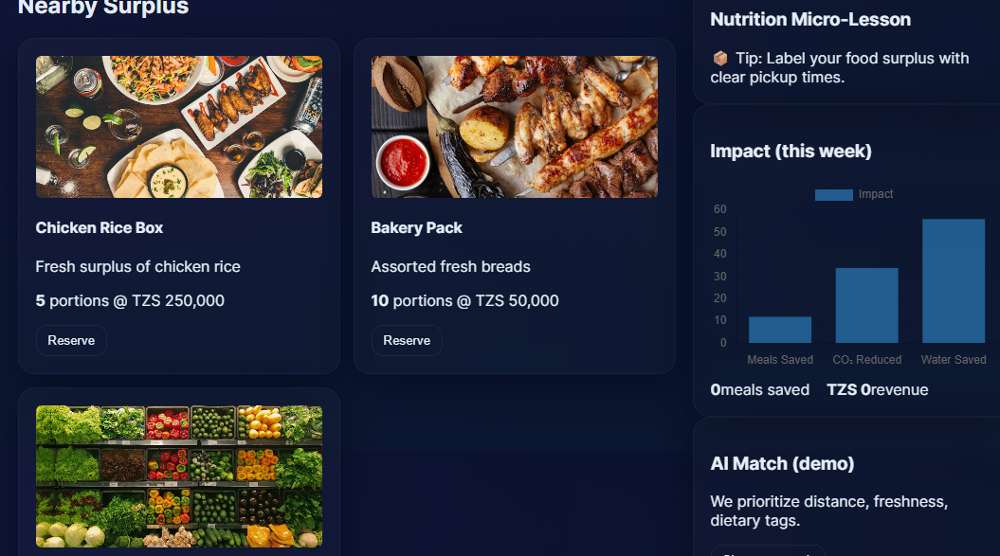
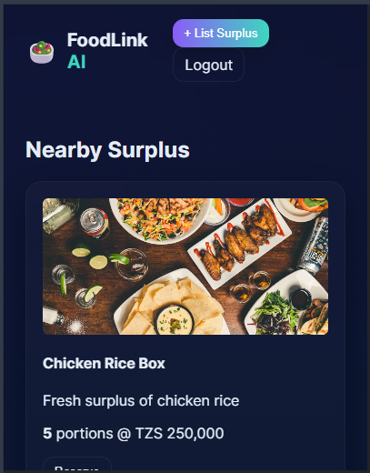
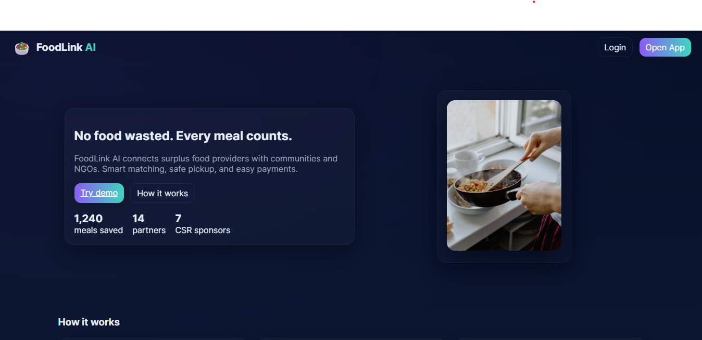

# FoodLink AI 🌱🥗

**Hackathon Submission - Food Waste Reduction Platform**  
**Team**: JANICE SEWAVA, ELVIS KESSY, ISHENGOMA KAKWEZI

---

## Live Demo

**[View Live Application](https://foodlinkai.netlify.app/)**

Successfully deployed on Netlify with full PWA functionality.

### Application Preview




_Desktop and mobile responsive design showcase_

---

## Overview

**FoodLink AI** is a hackathon project focused on **reducing food waste** by connecting surplus food providers (restaurants, bakeries, grocery stores) with communities, NGOs, and buyers using **AI-powered matching**. The platform works as a **web and mobile PWA**, includes real-time dashboards, micro-lessons, and optional monetization via **Paystack**.

---

## Key Features

- **Quick Listing**: Snap & list surplus food in 30 seconds
- **AI-Powered Matching**: Smart matching by distance, freshness, dietary needs
- **Secure Reservations**: Reserve & pickup securely with payment integration
- **Impact Dashboard**: Track meals saved, partners, revenue
- **PWA Ready**: Mobile-friendly Progressive Web App
- **Offline Support**: Offline-first support with Service Worker
- **Demo Mode**: Includes mock data for immediate testing

---

## Tech Stack

**Frontend:** HTML5, CSS3, JavaScript  
**Backend:** Python (FastAPI), MySQL  
**PWA:** Service Worker, Web App Manifest  
**AI & Tools:** Cursor AI, MetaGPT X, Supabase, Lovable Dev  
**Payments:** Paystack Integration  
**Deployment:** Netlify, Vercel, Heroku

---

## Repository & Deployment Links

**GitHub Repository**: [https://github.com/Jsews/hackathon2](https://github.com/Jsews/hackathon2)  
**Live Demo**: [https://foodlinkai.netlify.app/](https://foodlinkai.netlify.app/)  
**Pitch Deck**: [Canva Presentation](https://www.canva.com/design/DAGxt0-C9SU/npNLexSIkpwGqCljCNeFqQ/edit?utm_content=DAGxt0-C9SU&utm_campaign=designshare&utm_medium=link2&utm_source=sharebutton)

---

## Quick Start Guide

### Option 1: View Live Demo (Recommended)

Simply visit **[https://foodlinkai.netlify.app/](https://foodlinkai.netlify.app/)** to experience the full application with all features enabled.

### Option 2: Run Locally

1. **Clone the Repository**

   ```bash
   git clone https://github.com/Jsews/hackathon2.git
   cd hackathon2
   ```

2. **Frontend Demo Mode**

   - Open `index.html` in VS Code Live Server or any static server
   - Navigate to `/login.html` to sign in with demo credentials
   - Go to `/insight.html` to view AI-powered mock items and impact charts

3. **Backend Setup (Optional for real API)**
   - Create a MySQL database and run `answer.sql` to create tables
   - Create a Python virtual environment:
   ```bash
   python -m venv .venv
   .venv\Scripts\activate  # Windows
   ```
   - Install dependencies:
   ```bash
   pip install fastapi uvicorn mysql-connector-python python-jose PyJWT
   ```
   - Set environment variables and run:
   ```bash
   uvicorn main:app --reload --port 8000
   ```

---

## Project Structure

```
hackathon2/
│
├── index.html              # Main application entry point
├── login.html              # User authentication page
├── insight.html            # AI-powered dashboard
├── style.css               # Application styling
├── script.js               # Frontend functionality
├── sw.js                   # Service Worker for PWA
├── manifest.webmanifest    # PWA manifest
├── main.py                 # FastAPI backend server
├── answer.sql              # Database schema
├── public/                 # Assets and preview images
└── README.md               # Project documentation
```

---

## Deployment Options

### Option 1: Netlify (Frontend)

1. Push repository to GitHub
2. Connect Netlify and deploy
3. Enable PWA support

### Option 2: Heroku (Backend)

1. Create new Heroku app
2. Add environment variables
3. Deploy with GitHub integration

---

## Team Credits

**Developed by:**

- **JANICE SEWAVA** - Lead Developer
- **ELVIS KESSY** - Backend Developer
- **ISHENGOMA KAKWEZI** - Frontend Developer

**Project Focus:** Zero Hunger / Food Sustainability  
**Tools Used:** FastAPI, Supabase, Paystack, Cursor AI, MetaGPT X, Lovable Dev  
**Images:** Unsplash

---

## Development Notes

- Use demo mode for immediate web/mobile preview
- Connect Supabase Auth for real login functionality
- Enable HTTPS in production for secure payments and service worker
- Optional: Add animated impact charts and more food categories for visual appeal

---

**Hackathon Project: Reducing Food Waste Through Technology**  
Making a difference one meal at a time 🌍
